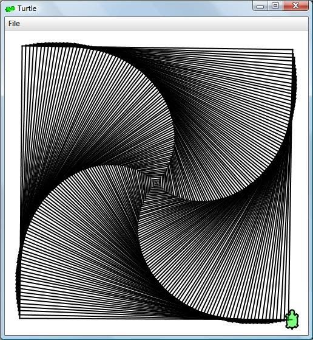

# Turtle
This page is dedicated to a custom Java class for drawing [turtle graphics](https://en.wikipedia.org/wiki/Turtle_graphics).  Turtle allows you to draw 2D graphics by telling a turtle what to do.  The turtle can turn and travel forwards and backwards.  You can also raise and lower the tail of the turtle to control whether it draws or not.  Complex drawings can be made with very little code.  Check out the code for the image at the bottom of the page.  

This is currently version 2.0 and has been in use by multiple teachers for over 10 years.  Version 3.0 is in the works.  It will likely be smaller and more feature complete.  New features: polyfill, 3D, better text support, arbitrary transforms.

[Documentation](https://sites.google.com/a/asmsa.org/java-turtle/turtle-documentation-api)

[Tutorial](https://en.wikipedia.org/wiki/Turtle_graphics)

[Lessons](https://sites.google.com/a/asmsa.org/java-turtle/tutorial)



SquareSpiral.java
```
public class SquareSpiral
{
    public static void main(String[] args) 
    {
        Turtle bob = new Turtle();
        for(int i=0;i<360;i++)
        {
            bob.forward(i*1.25);
            bob.left(90.25);
        }
    }
}
```

<iframe width="560" height="315" src="https://www.youtube.com/embed/Q84fbxt48OI" title="YouTube video player" frameborder="0" allow="accelerometer; autoplay; clipboard-write; encrypted-media; gyroscope; picture-in-picture" allowfullscreen></iframe>
